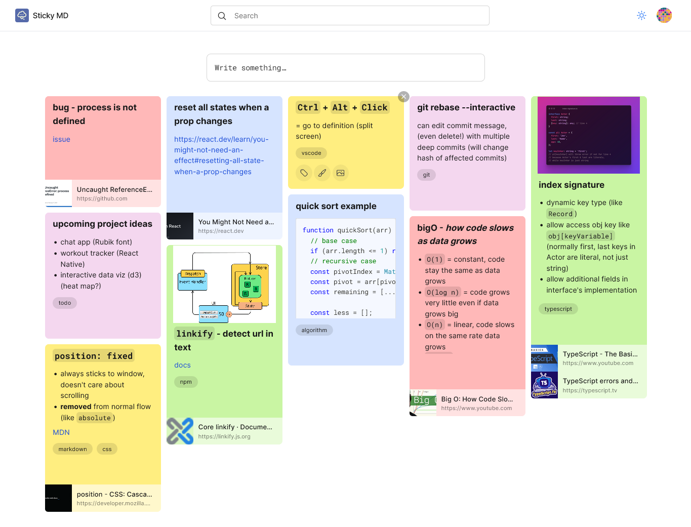

# Sticky MD

Sticky MD is (an attempt at) a note app like Google Keep but with Markdown support. 

## Features

- ⬇️ Markdown support ([Github Flavored Markdown](https://github.github.com/gfm/))
- 🌙 Dark mode
- 📔 Syntax highlighting for code blocks
- 🪄 Preview for external URLs
- 🏷️ Organize notes by labels
- 📸 Can contain images (`.jpg`, `.png`, `.gif`)

## Built with
- React
- TypeScript
- React-Markdown
- Radix UI
- Supabase
